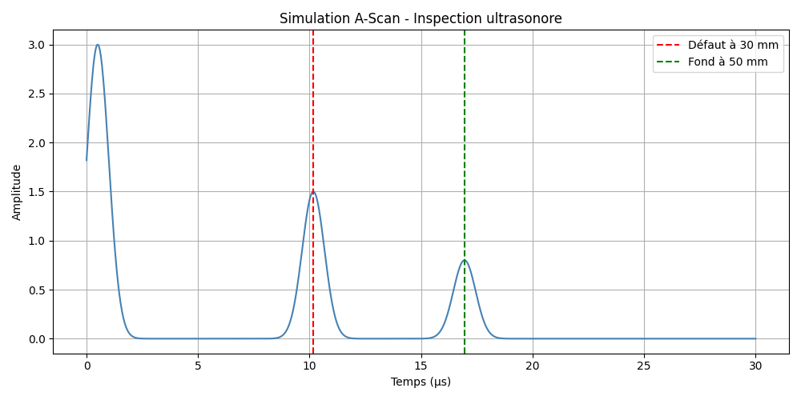

# Simulation d'un contrôle non destructif par ultrasons

## Description

Ce projet simule un contrôle ultrasonore de type A-Scan
dans un bloc d'acier contenant un défaut interne.

La simulation prend en compte :

- le temps de vol des ondes longitudinales ;
- l'atténuation du signal dans l'acier ;
- la réflexion sur un défaut ;
- la réflexion sur le fond de la pièce ;
- une onde ultrasonore modélisée par une sinusoïde
  modulée par une enveloppe gaussienne.

## Modèle physique

Temps de vol :

t = 2d / v

Atténuation :

A = A0 exp(-αd)

## Résultat

(image)

## Technologies

- Python
- NumPy
- Matplotlib

## Lancer le projet

pip install -r requirements.txt

python simulation.py

